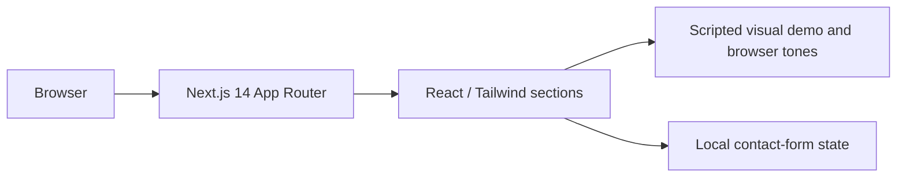

# CallAgentix

CallAgentix is a responsive B2B website that presents an AI voice-calling product concept for sales and customer support. Teams need a clear way to explore proposed agent, campaign, and support workflows before a calling platform is available.

## Implemented features

- Next.js marketing pages with responsive layouts and Framer Motion transitions.
- Illustrative agent, campaign, transcript, and support dashboard screens.
- A timed scripted conversation player with browser-generated ring and connect tones.
- A contact-form **preview** that validates input locally. It does not transmit or retain requests.
- Metadata, sitemap, robots rules, web manifest, and an Open Graph image.

This repository does **not** contain a dialer, telephony integration, live LLM conversation engine, CRM sync, multi-tenant backend, newsletter service, or deployed contact endpoint. Dashboard figures and conversation outcomes are examples.

## Architecture and stack



TypeScript, React 18, Tailwind CSS 3, Framer Motion, and Lucide provide the frontend. `lib/demo-audio.ts` generates call tones; `components/sections/LiveDemo.tsx` supplies the scripted visual demo.

## Local setup

Requires Node.js 20 and npm. From this directory:

```bash
npm ci
cp .env.example .env.local
npm run dev
```

Open `http://localhost:3000`. `NEXT_PUBLIC_SITE_URL` is optional locally; set it to the actual HTTPS origin for production metadata and sitemap generation.

## Validation and deployment

```bash
npx tsc --noEmit
npm run lint
npm run build
npm start
```

There is no automated test suite. Check the layout at mobile and desktop widths, play the scripted demo, and verify that the form states it is only a preview. Deploy as a standard Next.js application with Node.js support and configure `NEXT_PUBLIC_SITE_URL`. Connect a real form service only after adding consent, abuse protection, and data handling policies. No external API keys are required for the current website.

## Attribution and licensing

The maintainer confirmed publication rights for the application source. The original nine MP3 recordings are excluded from this repository because their redistribution rights could not be verified. The CallAgentix SVG mark was created for this rebrand. The local snapshot has no source Git history or root license file; no exclusive ownership of third-party assets is asserted.

Repository: [Gaurav598/CallAgentix-AI-Calling-SaaS](https://github.com/Gaurav598/CallAgentix-AI-Calling-SaaS)
